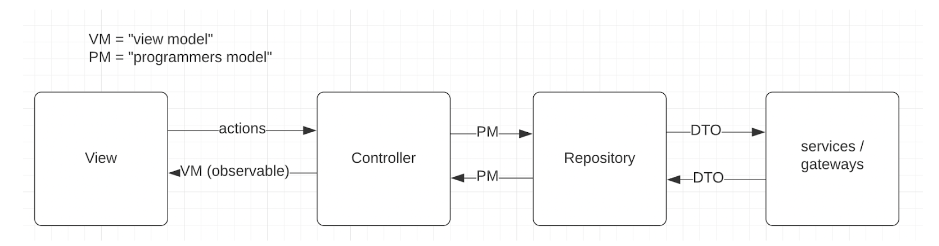

Fast-Test Homework
---

This task is about the fast-test approach (TDD, BDD or other names.. :) )  
Read the Appendix for coding guidelines. Feel free to send us questions about
the task.

> If you are stuck, there is a ready hint we can provide.

There is no focus on UI on this task.

## Part 1

In this part you are required to refactor a “simple” React into a fast-test
approach. The focus here is on “flat presentation”, or completely separating the
UI from the logic.

### Intro

We have a page that shows a list of “books”, plus a button to add a book (some
mocked hardcoded data).   
From a technical point of view, there is API that uses the format   
[https://tdd.demo.reaktivate.com/v1/books/\[user\]](https://tdd.demo.reaktivate.com/v1/books/[user])   
Where “user” is your identifier (nickname).   
API
swagger: [https://tdd.demo.reaktivate.com/api-docs/](https://tdd.demo.reaktivate.com/api-docs/)  
NB: API has SSL self-signed, so to work you’ll need to open any API endpoint in
the browser directly and “allow” this certificate to be used.

### The Task

Please **refactor** the existing solution:  
[https://codesandbox.io/s/reaktivate-tdd-challenge-1-sample-begin-ljjpo](https://codesandbox.io/s/reaktivate-tdd-challenge-1-sample-begin-ljjpo)

\* To save your own version:

* Login to codesandbox
* Use “fork” and save your own version

### Requirements for refactoring

The Basic requirement is to have the **logic separated from the rendering**, so
that it’s possible to have **test-on-logic**. Logic means business, and the
majority of UX. It’s nice if you take courage to rewrite to the usage of TS.   
Parts of solution:

1. **Zero logic and calculations in TSX/JSX files \-** Use MVP (or, in other
   name, MVVM) pattern where the component transfers all the logic to the
   Controller. It’s Important to separate the View, and be able to test. The
   rest is less important. Any JS code besides connecting the Controller in
   View (JSX) is actually incorrect.
2. The Controller/presenter should be a small MobX class, to provide
   observability. In case you don’t know MobX it’s fine to use Contexts.

## Part 2 \- Power-up task

1. The customer is requesting a “switch” on the interface, between “All books”
   and “Private books” (see API).   
   These two are mutually exclusive (buttons or radio or tabs, not checkboxes).
2. Also, one more sticky **application-wide** header is requested. The header
   should have a counter with private books, like “Your books: 30”.

### Refactoring target: Architecture pattern

Naming is taken from the following scheme:

That’s more a less a MVP (model-view-presenter) pattern. “Repository” layer is
optional, if the controller is super simple, it’s fine to use service directly.
Using “global” singleton state is preferred rather than “transient” controllers.

## APPENDIX: CodeStyle

1. Component folder structure
    * component-name
    * ComponentName.tsx \- react view, only render part, maximum dumb
    * ComponentName.model.ts \- mobx store for data fetching and saving
    * ComponentName.* ctrl.ts \- mobx store controller for view, so we can put
      all logic here
    * ComponentName.ctrl.spec.ts \- mobx store controller tests coverage
    * ComponentName.type.ts ComponentName.util.ts
      ComponentName.mock.tsComponentName.scss
2. Every component that **has logic** (is semantically bound), has its own local
   controller store. If needed \- use a global store that only contains data
   which could be shared across the whole application e.g. userStore, uiStore
   etc.
3. In View, there is only Mobx store usage. All the logic should be in stores,
   View is only for rendering.
4. Test store/logic mostly, View is optional
5. Make sure ViewModel data type is as obvious as possible
6. Views are functional
7. Stores are MobX classes
8. Use direct store import where possible (if singleton controller, otherwise
   passing store / context with any IoC)
9. Init store where you need it: in store file for 1 store per all components,
   or in the component to have separate store for each component
10. For Mobx async actions use async/wait \+ try/catch \+
    runInAction [https://mobx.js.org/actions.html](https://mobx.js.org/actions.html)
11. Remove console.log, use console.debug in case if you need to leave it for
    debug purpose
12. While refactoring be careful and check all code/components usage
